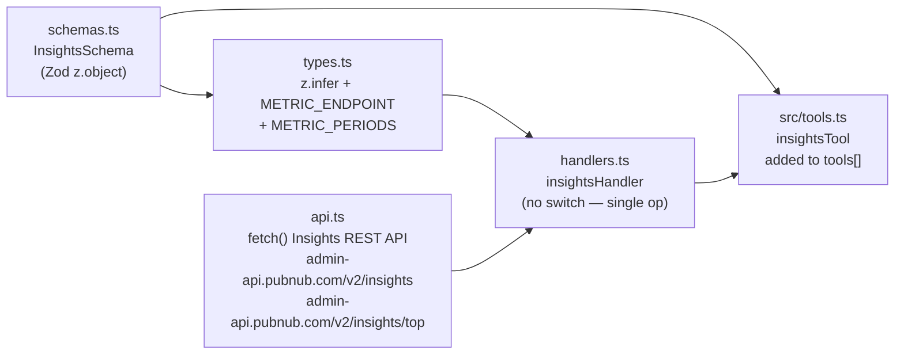
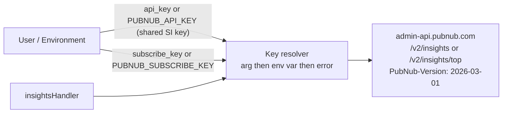

# Phase 2 — insights Core Tool

## Target repo

```
/Users/nicolis.miller/Documents/GitHub/pubnub-mcp
```

Follow the exact same pattern used by the existing `src/lib/portal/` and
`src/lib/illuminate/` modules. Read those files before starting to match conventions
for imports, error handling, and response formatting.

This phase is **substantially smaller than Illuminate Phase 2** because Insights is
read-only:

- No CRUD operations, just one read operation
- No resource lifecycle (no activate/deactivate)
- No 2-step decision workflow
- No default injection
- No fake-data publish
- No `getPubNubClient` dependency
- No PubNub publish/subscribe key resolution

---

## Module structure

```
src/lib/insights/
  schemas.ts    — Zod schema
  types.ts      — inferred types + METRIC_ENDPOINT + METRIC_PERIODS const maps
  api.ts        — HTTP client (single queryInsights method)
  handlers.ts   — single handler (no operation routing)
```



---

## schemas.ts

All rules belong in `.describe()` strings — the schema is the tool's documentation.

```typescript
import { z } from "zod";

export const InsightsSchema = z.object({
  subscribe_key: z.string().optional()
    .describe("PubNub subscribe key for the keyset to query (sub-c-...). Required by every Insights call. Optional in the schema so the handler can fall back to the PUBNUB_SUBSCRIBE_KEY env var; if neither is provided the handler returns an error."),

  metric: z.enum([
    // Channels
    "unique_channels",
    "unique_channels_combination",
    "percent_unique_channels_with_messages",
    "channel_patterns",
    "top_20_channels",
    "top_1000_channels",
    // Users
    "unique_users",
    "unique_users_combination",
    "percent_unique_users_with_messages",
    "new_vs_recurring_users",
    "unique_users_by_country",
    "top_20_users",
    "top_1000_users",
    // Messages
    "messages",
    "top_10_message_types",
    "message_by_country",
    // User Behavior (duration metrics — hourly only)
    "avg_user_duration",
    "unique_users_by_duration_timeframe",
    "top_20_channels_with_user_duration",
    "top_1000_channels_with_user_duration",
    // Devices
    "publishes_by_device_type",
    "subscribers_by_device_type",
    "unique_users_by_device_type",
  ]).describe("Insights metric to query. Top metrics (top_20_*, top_1000_*) route to /v2/insights/top automatically and require the `category` parameter. Duration metrics (avg_user_duration, unique_users_by_duration_timeframe, top_*_channels_with_user_duration) only support period=hourly. new_vs_recurring_users does NOT support period=hourly. See Period Restrictions table in the how-to guide for the full matrix."),

  period: z.enum(["hourly", "daily", "weekly", "monthly"])
    .describe("Time grain. Default to `daily` for most queries. Use `hourly` for intra-day or duration metrics. `weekly` and `monthly` are not supported by top-N metrics, country breakdowns, or device metrics for some categories."),

  start_date: z.string()
    .describe("Inclusive ISO 8601 start date in UTC (YYYY-MM-DD). All Insights timestamps are UTC."),

  end_date: z.string()
    .describe("Inclusive ISO 8601 end date in UTC (YYYY-MM-DD). All Insights timestamps are UTC."),

  category: z.enum([
    "by_messages",
    "by_chats",
    "by_subscribers",
    "by_users_with_messages",
    "by_users_with_chats",
    "by_subscribed_channels",
    "all",
  ]).optional()
    .describe("Required ONLY for top metrics (top_20_*, top_1000_*). Picks the ranking dimension. by_subscribers, by_users_with_messages, by_users_with_chats apply to channel rankings only. by_subscribed_channels applies to user rankings only. Use `all` for combined results."),

  filter: z.string().optional()
    .describe("Filter expression. Most useful with metric=channel_patterns to filter by name prefix or exact match (e.g. `startsWith:group.` or `eq:lobby`)."),

  orderBy: z.string().optional()
    .describe("Sort field and direction (e.g. `count_messages:desc`). Optional — most metrics default to a sensible ordering."),

  limit: z.number().int().positive().optional()
    .describe("Number of results to return. Optional — top metrics already cap at 20 or 1000 by name."),

  api_key: z.string().optional()
    .describe("Service Integration API key (si_...) used for Insights. Falls back to PUBNUB_API_KEY env var (the same key used by other admin tools such as manage_illuminate). The Service Integration must have Account-level Insights Read permission. Get one from PubNub Portal → My Account → Organization Settings → API Management → Service Integrations."),
});
```

### Critical API rules to embed in `.describe()` strings

- All dates and timestamps are **UTC**
- Period restrictions:
  - Duration metrics (`avg_user_duration`, `unique_users_by_duration_timeframe`,
    `top_*_channels_with_user_duration`) → `period=hourly` ONLY
  - Top metrics (`top_20_*`, `top_1000_*`) → `period=hourly` or `daily` only (not weekly/monthly)
  - Country metrics (`unique_users_by_country`, `message_by_country`) → not weekly/monthly
  - `new_vs_recurring_users` → not hourly
- Top metrics require the `category` parameter — without it, the API returns 400
- **Top-N counts cannot be summed across periods.** When `period=daily` is used with a
  top metric, return one ranking per day rather than aggregating
- Account must be on Insights Premium for API access (Free has no access; Pro existing
  customers may need to upgrade from Standard to Premium)

---

## types.ts

```typescript
import { z } from "zod";
import { InsightsSchema } from "./schemas.js";

export type InsightsSchemaType = z.infer<typeof InsightsSchema>;

// Which endpoint each metric routes to.
export const METRIC_ENDPOINT: Record<string, "insights" | "insights/top"> = {
  // Top endpoint (/v2/insights/top)
  top_20_channels:                       "insights/top",
  top_1000_channels:                     "insights/top",
  top_20_users:                          "insights/top",
  top_1000_users:                        "insights/top",
  top_10_message_types:                  "insights/top",
  top_20_channels_with_user_duration:    "insights/top",
  top_1000_channels_with_user_duration:  "insights/top",
  // Regular endpoint (/v2/insights) — everything else
  unique_channels:                          "insights",
  unique_channels_combination:              "insights",
  percent_unique_channels_with_messages:    "insights",
  channel_patterns:                         "insights",
  unique_users:                             "insights",
  unique_users_combination:                 "insights",
  percent_unique_users_with_messages:       "insights",
  new_vs_recurring_users:                   "insights",
  unique_users_by_country:                  "insights",
  messages:                                 "insights",
  message_by_country:                       "insights",
  avg_user_duration:                        "insights",
  unique_users_by_duration_timeframe:       "insights",
  publishes_by_device_type:                 "insights",
  subscribers_by_device_type:               "insights",
  unique_users_by_device_type:              "insights",
};

// Allowed periods per metric (used for runtime validation in handler).
export const METRIC_PERIODS: Record<string, ReadonlyArray<"hourly" | "daily" | "weekly" | "monthly">> = {
  // Duration metrics — hourly only
  avg_user_duration:                       ["hourly"],
  unique_users_by_duration_timeframe:      ["hourly"],
  top_20_channels_with_user_duration:      ["hourly"],
  top_1000_channels_with_user_duration:    ["hourly"],
  // Top metrics — hourly or daily
  top_20_channels:                         ["hourly", "daily"],
  top_1000_channels:                       ["hourly", "daily"],
  top_20_users:                            ["hourly", "daily"],
  top_1000_users:                          ["hourly", "daily"],
  top_10_message_types:                    ["hourly", "daily"],
  // Country metrics — hourly or daily
  unique_users_by_country:                 ["hourly", "daily"],
  message_by_country:                      ["hourly", "daily"],
  // new_vs_recurring_users — daily, weekly, or monthly (NOT hourly)
  new_vs_recurring_users:                  ["daily", "weekly", "monthly"],
  // Everything else — all four periods
  unique_channels:                         ["hourly", "daily", "weekly", "monthly"],
  unique_channels_combination:             ["hourly", "daily", "weekly", "monthly"],
  percent_unique_channels_with_messages:   ["hourly", "daily", "weekly", "monthly"],
  channel_patterns:                        ["hourly", "daily", "weekly", "monthly"],
  unique_users:                            ["hourly", "daily", "weekly", "monthly"],
  unique_users_combination:                ["hourly", "daily", "weekly", "monthly"],
  percent_unique_users_with_messages:      ["hourly", "daily", "weekly", "monthly"],
  messages:                                ["hourly", "daily", "weekly", "monthly"],
  publishes_by_device_type:                ["hourly", "daily", "weekly", "monthly"],
  subscribers_by_device_type:              ["hourly", "daily", "weekly", "monthly"],
  unique_users_by_device_type:             ["hourly", "daily", "weekly", "monthly"],
};

// Top metrics that REQUIRE the `category` parameter.
export const TOP_METRICS_REQUIRING_CATEGORY: ReadonlySet<string> = new Set([
  "top_20_channels",
  "top_1000_channels",
  "top_20_users",
  "top_1000_users",
  "top_20_channels_with_user_duration",
  "top_1000_channels_with_user_duration",
]);
```

---

## api.ts

Base URL: `https://admin-api.pubnub.com/v2`
Auth header: `Authorization: <api_key>` (the key starts with `si_`)
Version header: `PubNub-Version: 2026-03-01` (verify exact value against live spec in
the `verify-api-spec` todo before coding)

Methods to implement:

- `queryInsights(args, apiKey)` — GET `/v2/${endpoint}` where `endpoint` is
  `METRIC_ENDPOINT[args.metric]`. Serialize `subscribe_key`, `metric`, `period`,
  `start_date`, `end_date`, and any provided optional fields (`category`, `filter`,
  `orderBy`, `limit`) as URL query parameters.

```typescript
import { METRIC_ENDPOINT, type InsightsSchemaType } from "./types.js";

const BASE = "https://admin-api.pubnub.com/v2";
const VERSION = "2026-03-01";

async function handleResponse(res: Response): Promise<unknown> {
  const text = await res.text();
  if (!res.ok) {
    throw new Error(`Insights API ${res.status}: ${text || res.statusText}`);
  }
  if (!text) return { success: true };
  try {
    return JSON.parse(text);
  } catch {
    return text;
  }
}

export async function queryInsights(
  args: InsightsSchemaType,
  apiKey: string,
): Promise<unknown> {
  const endpoint = METRIC_ENDPOINT[args.metric];
  if (!endpoint) {
    throw new Error(`Unknown metric: ${args.metric}`);
  }

  const params = new URLSearchParams();
  params.set("subscribe_key", args.subscribe_key);
  params.set("metric", args.metric);
  params.set("period", args.period);
  params.set("start_date", args.start_date);
  params.set("end_date", args.end_date);
  if (args.category)  params.set("category", args.category);
  if (args.filter)    params.set("filter", args.filter);
  if (args.orderBy)   params.set("orderBy", args.orderBy);
  if (args.limit !== undefined) params.set("limit", String(args.limit));

  const url = `${BASE}/${endpoint}?${params.toString()}`;

  const res = await fetch(url, {
    method: "GET",
    headers: {
      "Authorization":   apiKey,
      "PubNub-Version":  VERSION,
      "Content-Type":    "application/json",
    },
  });

  return handleResponse(res);
}
```

### Rate limiting and retries

`api.ts` does **not** implement retry logic — this matches the existing `src/lib/portal/`
and `src/lib/illuminate/` module pattern. `429 Too Many Requests` and transient `5xx`
errors are thrown by `handleResponse`, caught by the handler's `catch (e)` block, and
surfaced to Claude as error responses. Claude can then inform the user and ask them to
retry. This is an explicit design decision for consistency with the rest of the codebase.

### Pagination

`queryInsights` passes the full API response through without modification, including any
`next` or `offset` pagination tokens. Callers receive the raw response structure. This
is consistent with the portal module pattern. Full pagination support (auto-fetching all
pages) is a future enhancement if needed.

---

## handlers.ts

```typescript
import { queryInsights } from "./api.js";
import {
  METRIC_PERIODS,
  TOP_METRICS_REQUIRING_CATEGORY,
  type InsightsSchemaType,
} from "./types.js";
import { createResponse, parseError } from "../utils.js"; // match the portal/illuminate import path

export async function insightsHandler(args: InsightsSchemaType) {
  try {
    // 1. Resolve API key (arg → env → error). Insights reuses the existing
    //    PUBNUB_API_KEY Service Integration key — no new env var.
    const apiKey = args.api_key ?? process.env.PUBNUB_API_KEY;
    if (!apiKey) {
      return createResponse(
        "insights requires a Service Integration API key. " +
        "Provide it via the api_key argument or set PUBNUB_API_KEY in your environment " +
        "(the same key used by manage_illuminate). The Service Integration must have " +
        "Account-level Insights Read access. Create or update one in PubNub Portal → " +
        "My Account → Organization Settings → API Management → Service Integrations. " +
        "Note: Insights API requires Insights Premium tier (Free plan has no API access).",
        true,
      );
    }

    // 2. Resolve subscribe key (arg → env)
    const subscribeKey = args.subscribe_key ?? process.env.PUBNUB_SUBSCRIBE_KEY;
    if (!subscribeKey) {
      return createResponse(
        "insights requires a subscribe_key (sub-c-...) — pass it as an argument or set " +
        "PUBNUB_SUBSCRIBE_KEY in your environment.",
        true,
      );
    }

    // 3. Period restriction check
    const allowedPeriods = METRIC_PERIODS[args.metric];
    if (allowedPeriods && !allowedPeriods.includes(args.period)) {
      return createResponse(
        `Metric "${args.metric}" does not support period="${args.period}". ` +
        `Allowed periods: ${allowedPeriods.join(", ")}.`,
        true,
      );
    }

    // 4. Category requirement check for top metrics
    if (TOP_METRICS_REQUIRING_CATEGORY.has(args.metric) && !args.category) {
      return createResponse(
        `Metric "${args.metric}" requires the category parameter. ` +
        `Valid categories: by_messages, by_chats, by_subscribers, by_users_with_messages, ` +
        `by_users_with_chats, by_subscribed_channels, all.`,
        true,
      );
    }

    // 5. Make the call
    const result = await queryInsights(
      { ...args, subscribe_key: subscribeKey },
      apiKey,
    );
    return createResponse(JSON.stringify(result));
  } catch (e) {
    return createResponse(JSON.stringify(parseError(e)), true);
  }
}
```

### Response pattern

Match the existing portal/illuminate handler pattern exactly:

- Success: `return createResponse(JSON.stringify(result))`
- Error: `return createResponse(JSON.stringify(parseError(e)), true)`

`createResponse` expects a `string` for its first argument and `parseError` returns an
object, so the `JSON.stringify` wrap is required. See `src/lib/illuminate/handlers.ts`,
`src/lib/portal/handlers.ts`, and `src/lib/docs/handlers.ts` for the same pattern.

---

## src/tools.ts changes

Add after the last existing tool import:

```typescript
import { insightsHandler } from "./lib/insights/handlers.js";
import { InsightsSchema } from "./lib/insights/schemas.js";
```

Define the tool:

```typescript
const insightsTool = {
  name: "insights",
  definition: {
    title: "Query PubNub Insights",
    description: `Queries PubNub Insights — read-only aggregated analytics from your PubNub account.

      Two endpoints, picked automatically by metric name:
      - /v2/insights        → aggregated metrics (unique_channels, unique_users, messages, etc.)
      - /v2/insights/top    → ranked metrics (top_20_channels, top_20_users, top_10_message_types, etc.)

      TOOL SELECTION GUIDE — Insights Claude Behavior:

      1. Group-aware: Insights metrics are organized into 5 functional groups — Channels, Users,
         Messages, User Behavior, Devices. When a user asks an analytic question, pick the right
         group first and then the specific metric. See the how-to guides:
         how_to(slug="how-to-query-insights-channels"), users, messages,
         user-behavior-and-devices.

      2. Period rules (enforced at runtime):
         - Duration metrics (avg_user_duration, unique_users_by_duration_timeframe,
           top_*_channels_with_user_duration) → period=hourly ONLY.
         - Top-N metrics (top_20_*, top_1000_*) → hourly or daily ONLY (no weekly/monthly).
         - Country metrics → hourly or daily ONLY.
         - new_vs_recurring_users → daily / weekly / monthly only (NOT hourly).
         - All other metrics → all four periods supported.

      3. Top metrics REQUIRE category. Without it, the call errors. Valid categories:
         by_messages, by_chats, by_subscribers, by_users_with_messages,
         by_users_with_chats, by_subscribed_channels, all.

      4. UTC timestamps. start_date and end_date are ISO 8601 dates in UTC. Always frame the
         response with the date range and timezone so the user has unambiguous context.

      5. Top-N counts CANNOT be summed across periods. If the user asks for "top channels this
         week" and you query with period=daily, return one ranking per day, not a weekly sum.

      6. Default to period=daily for most queries. It supports the widest set of metrics and
         gives a clean trend view. Use hourly only when intra-day granularity is needed or for
         duration metrics.

      7. Account must be on Insights Premium. Free plan has no API access. Pro existing
         customers may need to upgrade from Standard to Premium. If a 403 comes back, surface
         this as the likely cause.

      8. The tool does not write or store anything. Insights is strictly read-only.
    `,
    inputSchema: InsightsSchema,
  },
  handler: insightsHandler,
};
```

Append to `tools[]` export:

```typescript
export const tools = [
  // ...existing tools...
  insightsTool,
];
```

---

## Authentication



Key resolution order: argument → env var → throw error with helpful message.

Key reuse: Insights uses the **same** Service Integration API key (`PUBNUB_API_KEY`)
that the existing `manage_illuminate` tool resolves. There is no separate
`INSIGHTS_API_KEY`. The Service Integration backing `PUBNUB_API_KEY` must have
**Account-level Insights Read** added to its permission list (in addition to whatever
permissions it already has for other tools).

How to update an existing key: PubNub Portal → My Account → Organization Settings →
API Management → open the Service Integration backing `PUBNUB_API_KEY` → add a
permission row at **Account** level with **Insights → Read**. The key continues to
start with `si_`.

Account requirement: **Insights Premium**. Free plan has no API access.

---

## Environment config

No new environment variable is added. The insights tool reuses the existing
`PUBNUB_API_KEY` and `PUBNUB_SUBSCRIBE_KEY` entries that are already declared in
`.env.sample` and `server.json`.

`.env.sample` — update only the `PUBNUB_API_KEY` description comment to mention
Insights Read alongside the existing scopes (e.g. Illuminate Read & Write). Do not add
a new variable.

`server.json` — update the description of the existing `PUBNUB_API_KEY` entry in
`environmentVariables[]` to mention Insights Read. Do not add a new entry. Suggested
description:

```
"description": "Service Integration API key (si_...) used by admin/platform tools (manage_illuminate, insights). Obtain from PubNub Portal → My Account → Organization Settings → API Management → Service Integrations. The Service Integration must include Account-level Insights Read for the insights tool, and Illuminate Read & Write for manage_illuminate. Insights API access requires Insights Premium tier."
```

The existing `PUBNUB_SUBSCRIBE_KEY` entry already works for Insights — no description
update needed beyond what is already documented for it.

---

## Claude behavior instructions (full reference)

These belong in the tool's `description` field in `src/tools.ts` (already inlined above):

### Group-aware metric picking

Pick the functional group first (Channels / Users / Messages / User Behavior / Devices)
based on the user's question, then the specific metric. The 4 published how-to guides
are organized this way.

### Enforce period restrictions

The handler validates at runtime and returns a helpful error. Claude should also
proactively pick a valid period — e.g. for "how long do users stay" use `hourly` for
`avg_user_duration` rather than asking the user.

### Top metrics — always include category

When using a `top_*` metric, always include `category`. Default to `by_messages` for
channels and `by_messages` for users unless the user clearly intends another ranking.

### UTC framing

Always include the date range and the word "UTC" in the response so the user has
unambiguous time context.

### Don't sum top-N across periods

If the user wants "top channels this week" and you use `period=daily`, present one daily
ranking per day. To produce a single weekly ranking, query the metric directly with the
right period and date range — do not aggregate the daily counts.

### Premium tier awareness

If the API returns 403, the most likely cause is the account is not on Insights Premium.
Surface this clearly: "Insights API access requires Insights Premium. Upgrade in the
Admin Portal under your plan settings."
